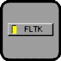
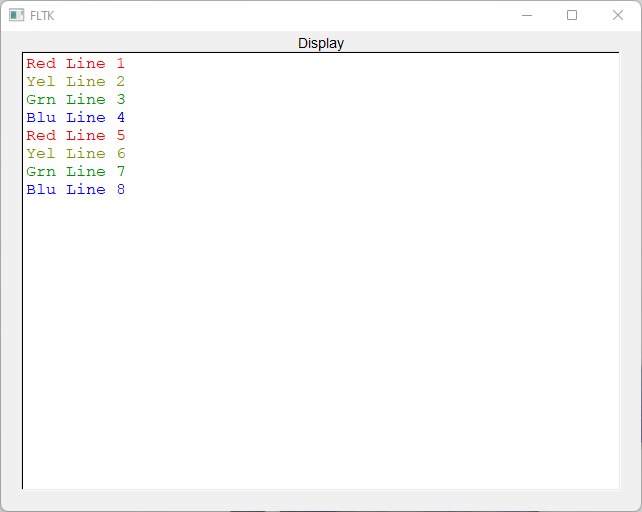
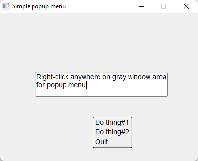
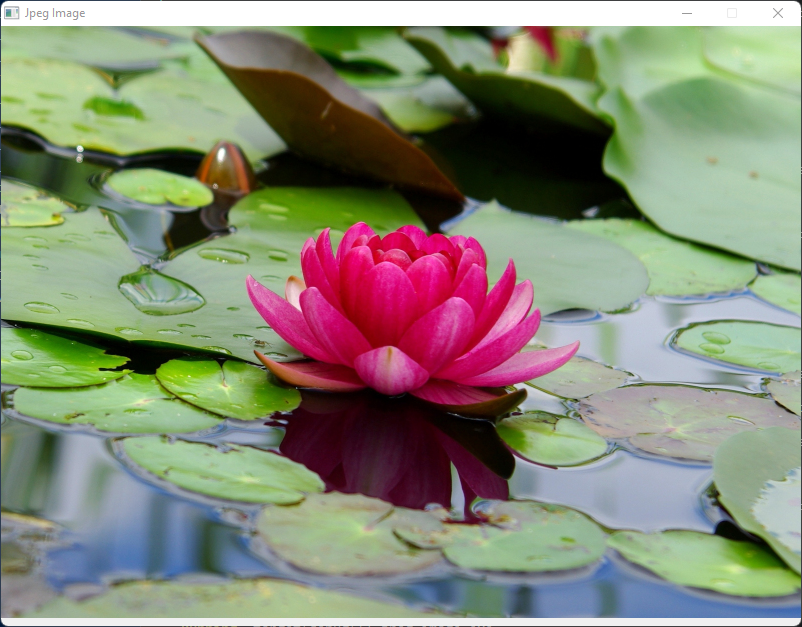
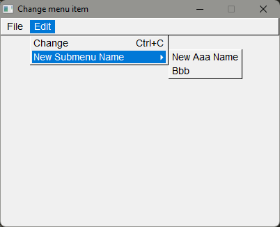
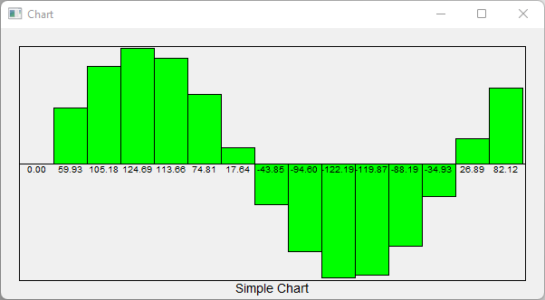

# Erco's fltk Cheat Page ported for Rust Language

* **TextDisplay**

```
$ cargo run --bin fl_text_display
```


* **TextDisplay Colors**

```
$ cargo run --bin fl_text_display_colors
```



* **Simple popup menu**

```
$ cargo run --bin fl_right_click_context_menu
```



* **Load Jpeg Image**
```
$ cargo run --bin fl_jpeg_image
```



* **Walk pixels of Jpeg Image**
```
$ cargo run --bin fl_raw_image
...
pixel index:479970, color-> r:175, r:202, b:171
pixel index:479973, color-> r:175, r:202, b:171
pixel index:479976, color-> r:176, r:203, b:172
pixel index:479979, color-> r:176, r:203, b:172
pixel index:479982, color-> r:176, r:203, b:172
pixel index:479985, color-> r:173, r:202, b:172
pixel index:479988, color-> r:172, r:203, b:172
pixel index:479991, color-> r:171, r:201, b:173
pixel index:479994, color-> r:172, r:203, b:172
pixel index:479997, color-> r:172, r:203, b:172
$
```

* **Change Menu Item**
```
$ cargo run --bin fl_change_menu_item
```



* **Chart**
```
$ cargo run --bin fl_chart
```

